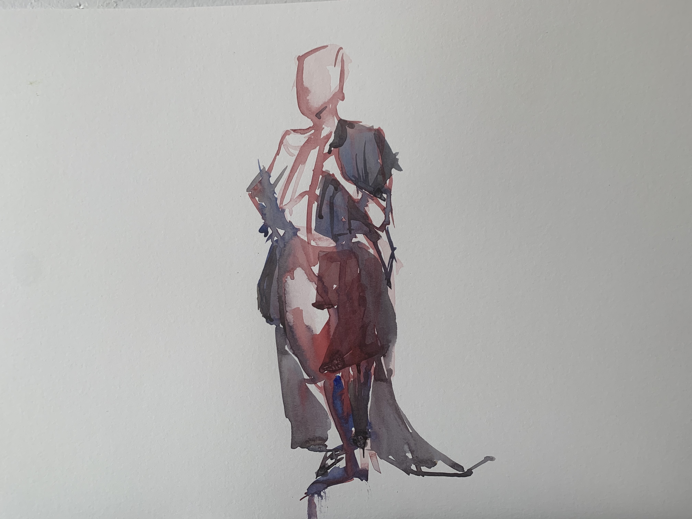
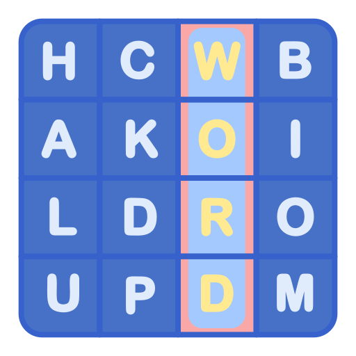

<!DOCTYPE html>
<html lang="en">
<head>
    <title>Tenzing's website</title>
    <link rel="stylesheet" href="style.css">
    <link rel="icon" href="alive.ico">
    <link rel="preconnect" href="https://fonts.googleapis.com"> 
<link rel="preconnect" href="https://fonts.gstatic.com" crossorigin> 
<link href="https://fonts.googleapis.com/css2?family=Merriweather&family=Montserrat&family=Sacramento&display=swap" rel="stylesheet">
</head>
<body>
      

        
        <h1 class="intro">I'm Tenzing.</h1>
        <h2>an aspiring software engineer</h2>
        
        
    

    

        

          
          <h2>Hello.</h2>
          
I am a computer science student with proficiency on C++, python, JavaScript, HTML, CSS, swift. Born and raised in the Himalyas.

        

        

        

          <h2>My Projects.</h2>
          

            
            <h3> <a href="https://tnyima19.github.io/Personal-Website/">Classy Personal Website(HTML, CSS)</a></h3>
            
This is a personal website with my projects and my information about myself.

          

          

            
            <h3>Python Data information using numpy, matplotlib and pandas.</h3>
            
Lorem ipsum dolor sit amet, mauris sed consectetuer. Etiam et eu, bibendum interdum, lacus quis mauris. Curabitur wisi, quisque vel eu, rutrum nam.

          

          

            
            <h3><a href="https://github.com/tnyima19/Simulate-Operating-System">Simulate Operating System(C++)</a></h3>
            
This is a project simulates operating system. Using various classes such as process, CPU scheduler, CPU, RAM, Operating system. Creates process, exits a process, prints currently running process. The process are queued according to their priority.

          

          

            
            <h3><a href="https://github.com/tnyima19/CountyDownty-2">COUNTYDOWNTY(Swift)</a></h3>
            
Countydownty is a game app where 9 letters are randomly generated.
            The player must make words out of the random letters.

          

        

        

        

          <h2>Get In Touch</h2>
          <h3>Lorem ipsum dolor sit amet, non elit.</h3>
          
If you love art as much as I do. Let's talk about it over coffee.I like art and art likes me.

          <a class="btn" href="mailto:tnyima19@email.com">CONTACT ME</a>
        

      

      
      
      

        <a class="footer-link" href="https://www.linkedin.com/in/tenzing-nyima/">LinkedIn</a>
        
© Tenzing Nyima.

      

      
</body>
</html>